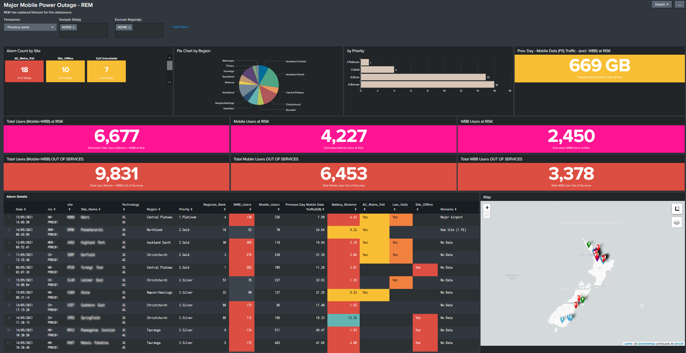

# Splunk Mobile Telecommunication Outages

Splunk Dashboard Visualisation to Track Major BTS Telecommunication Outages

## Table of contents
* [General info](#general-info)
* [Technologies](#technologies)
* [Setup](#setup)

## General info
I built this project to help the NOC Mobile telecommunication team generate a report during major BTS/Node-B Outages. 

During major outages, the monitoring alarm panel would be flooded with rows of alarms, and it would be difficult for the on-duty
engineer to sorting out the impact.

This dashboard will help the engineer analyse the impact in real-time.

Source of data ingested to Splunk from IBM Netcool databases.

## Technologies
Project is created with:
* Splunk Enterprise Version: 7.2.9
	
## Dashboard snapshot

Download it and have fun!
